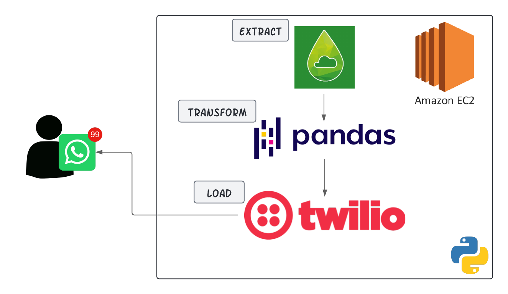

# Twilio Forecast

Twilio Forecast is a Python application that sends weather forecasts via Whatsapp using the Twilio API. This project demonstrates how to integrate weather data with Twilio to automate Whatsapp notifications.



## Features

- Fetches weather forecasts from a weather API
- Sends weather forecasts via Whatsapp using Twilio
- Configurable recipient phone numbers and message schedules

## Requirements

- Python 3.6+
- Twilio Account (with SID and Auth Token)
- Weather API Key

## Installation

1. Clone the repository:
    ```sh
    git clone https://github.com/alcarrillop/twilio-forecast.git
    cd twilio_forecast
    ```

2. Install the required packages:
    ```sh
    pip install -r requirements.txt
    ```

## Configuration

1. Create a `twilio_config.py` file in the project root with your Twilio credentials:
    ```python
    TWILIO_ACCOUNT_SID = 'your_account_sid'
    TWILIO_AUTH_TOKEN = 'your_auth_token'
    API_KEY_WAPI = 'your_weather_api_key'
    FROM_WP_NUMBER = 'your_twilio_phone_number'
    TO_WP_NUMBER = 'recipient_phone_number'
    
    ```

2. Update the `twilio_script.py` file with your preferred city for getting the forecast with the query parameter
.

## Usage

Run the script to send a weather forecast Whatsapp:
```sh
python twilio_script.py
```

## Running on an AWS EC2 Instance

1. **Launch an EC2 instance**:
   - Choose an Amazon Linux 2 AMI.
   - Configure security group to allow SSH access.

2. **Connect to your EC2 instance**:
    ```sh
    ssh -i /path/to/your-key-pair.pem ec2-user@your-ec2-instance-public-dns
    ```

3. **Install necessary software**:
    ```sh
    sudo yum update -y
    sudo yum install -y python3 git
    ```

4. **Clone the repository on the EC2 instance**:
    ```sh
    git clone https://github.com/alcarrillop/twilio-forecast.git
    cd twilio-forecast
    ```

5. **Install Python packages**:
    ```sh
    pip3 install -r requirements.txt
    ```

6. **Configure your environment on the EC2 instance**:
    Follow the same steps as above to create `twilio_config.py` with your credentials, you can use `nano` or `vim` for setting your variables.

## Scheduling with `crontab`

1. **Open the crontab editor**:
    ```sh
    crontab -e
    ```

2. **Add a cron job to run the script daily**:
    Add the following line to schedule the script to run every day at 7 AM:
    ```sh
    0 7 * * * /usr/bin/python3 /home/ec2-user/twilio-forecast/twilio_script.py
    ```

3. **Save and exit the editor**.

## Contributing

1. Fork the repository
2. Create a new branch (`git checkout -b feature-branch`)
3. Commit your changes (`git commit -am 'Add new feature'`)
4. Push to the branch (`git push origin feature-branch`)
5. Create a new Pull Request

## License

This project is licensed under the MIT License.
